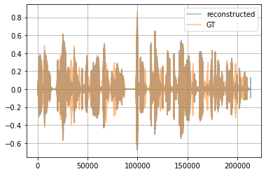
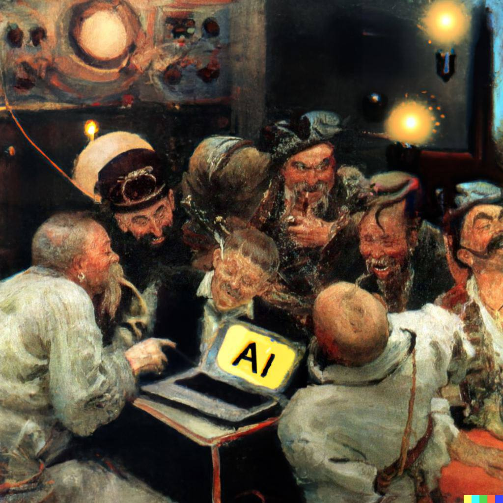

This is the realization of the HIFI-GAN https://arxiv.org/abs/2010.05646 👀
The realization is based on https://github.com/jik876/hifi-gan

    

The results can be listened in the 'samples' folder.
Waveform visualization of one of them is right above.

    

